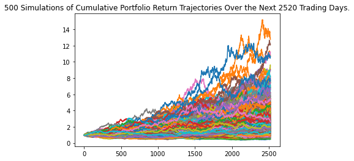
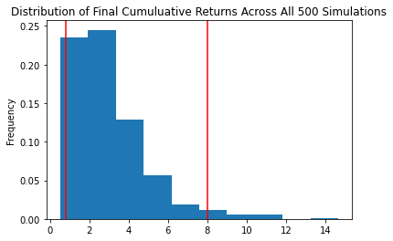

# Financial-Health-Checker
UW Fintech Bootcamp Module 5 Challenge  
  
Project was designed to have us develop applications that can help a consumer determine if they have enough savings for an emergency, and determine if they will have enough in 30 or 10 years

---

## Technologies

The following libraries are used in this analysis:  
  
  *  os  
  *  requests   
  *  json  
  *  pandas  
  *  dotenv  
  *  alpaca_trade_api  
  *  MCForecastTools
  *  matplotlib
  
---

## Purpose of Program

### Application 1 (Emergency Fund)
  
  *  Calculate value of crypto, stock and bond porfolios  
  *  Compare the value of the combined portfolio to 3 months salary 
  *  Based on calculation offer up a statement letting the member know their savings status  
  
### Application 2 (Retirement Planning)  
  
  *  Taking current values of stock and bond portfolios run 500 Monte Carlo simulations   
  *  30 Years with a mix of 60% bonds and 40% stocks 
  *  10 Years with 80% stock & 20% bonds   
  *  For both scenarios plot the results and evaluate against the 95% CI
  *  Present results and offer recommendation

---

## Conclusions

Based on the data provided, the member has more than enough to cover their emergency fund and they should consider investing it.

However, the stock market has been very volitile over the last 3 years and the bond market has had very small returns, making retirement in 10 years risky without having further information available.

As you can see below the 10 year window has wild swings and the likelyhood of significant returns is not present at this time

  

  

---

## Contributors

Special thanks to instructor (Gerit Hall), teaching assistants (Kyle Gee & Aarti Couture), and tutor (Katie Kirby) as well as classmate (Dan McQueen) for supporting me through various coding issues.

---

## License

Program is free to use without license.  Only request is that you notify author of use and application
